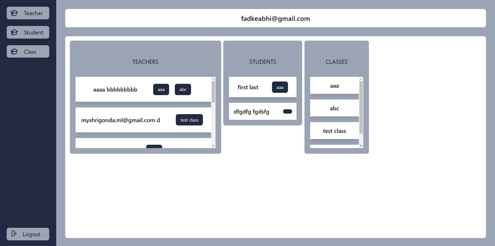
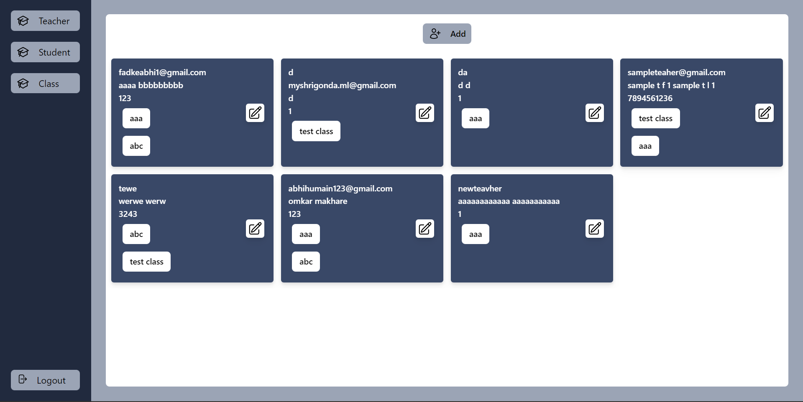
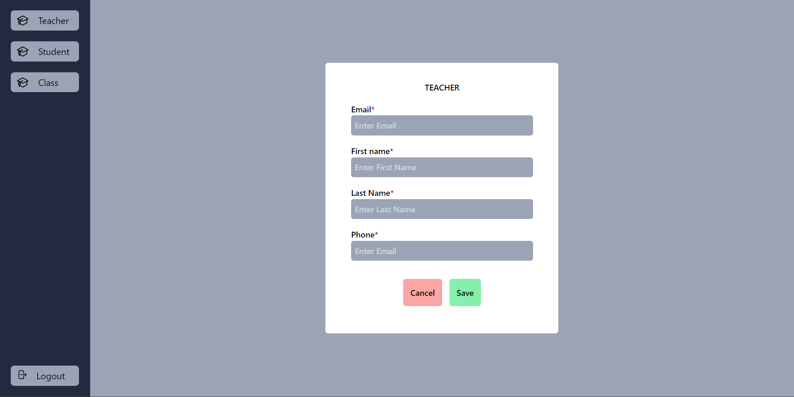
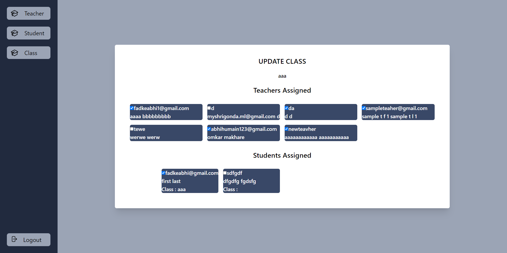
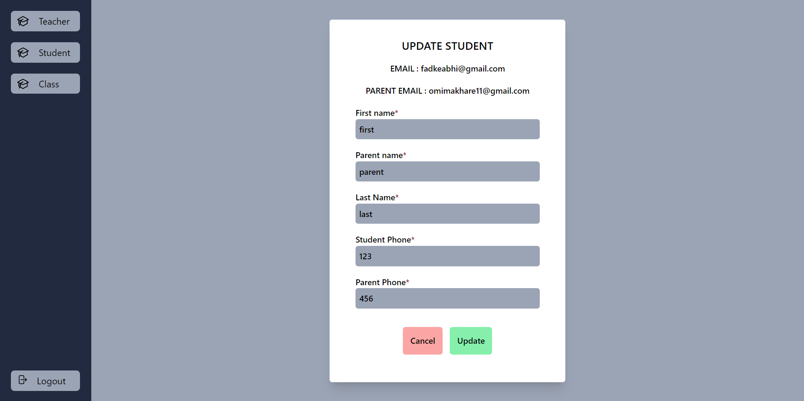
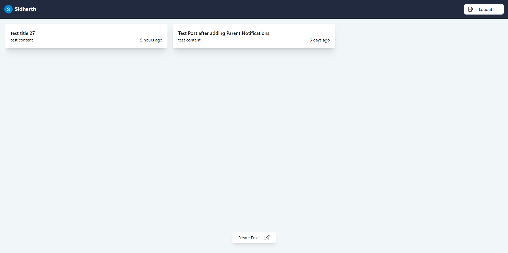
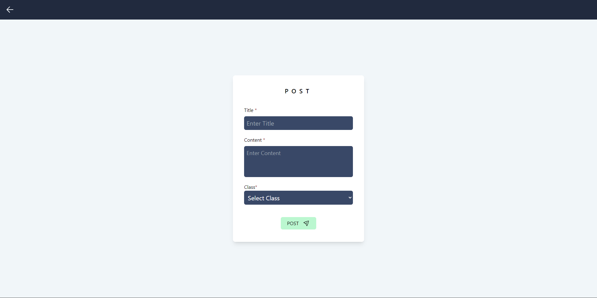
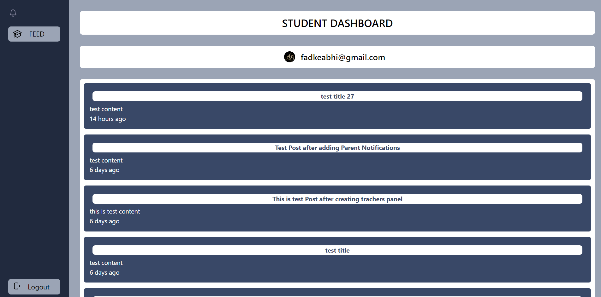
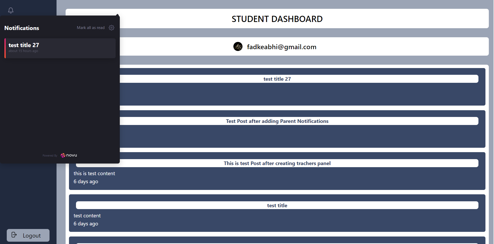

# appwrite-school-notification: [Appwrite](https://appwrite.io) [Hashnode](https://hashnode.com) Hackathon

## Team Details

- Siddharth Bramhecha - @teammember1
- ABHISHEK FADAKE - @fadkeabhi

## Description of Project

The project we have built is the "Notification Management System for School".

The system includes an admin module for managing teachers, classes, and student data.

Teachers can send posts to their assigned classes, while students and parents can access these posts through their respective modules.

It aims to In-app and email notifications ensure timely updates. This system streamlines communication and improves engagement within the school community. The system consists of several interconnected modules that work together to achieve its intended purpose.

- Admin
    - In admin section, we can add and update the teachers, classes and students.
- Teacher
    - In Teacher section, teacher can add the post and it will generate the notification to students and parents.
    - Teacher can create post for their respective class / classes only.
- Student / Parent
    - In this section, students or parents can see the latest post created in class they are assigned to.
    - Also an In-App Notification from NOVU will be shown here.

## Tech Stack

- Appwrite Cloud
    - Authentication
    - Database
- Novu
- Node.js
- Express.js
- React.js

For authentication, we have used Appwrite authentication and session. After getting the session the user gets redirected to its corresponding section.

We have created user-friendly interface to interact and feel attractive towards it.

We used the appwrite Database to store our documents.

## Challenges We Faced

1. Auth redirect
    - Issue: In appwrite it was giving an error if we give callback to backend.
    - Solution: We made the callback to frontend and then sent the user info to backend, then validated that auth info and implemented further logic.

2. Select query
    - Issue: Current appwrite version doesn't support the select query. 
    - Solution: We got documents without the select query, then formatted the document using js on backend.

3. Push and Pop in array
    - Issue: As we know there was no way to execute push and pop operations on array field in a document directly.
    - Solution: We get the current document on backend, then Made the push or Pop operation on required array using array push/splice methods in js. Then update the document with updated array.

## Public Code Repo

https://github.com/fadkeabhi/appwrite-school-notification

## Screenshoot
 
Login Page:

 
Admin Dashbord:

 
Admin Dashbord All Teachers List:

 
Admin Dashbord Create New Teacher:

 
Admin Dashbord Update Teacher:

 
Admin Dashbord Update Class:

 
Admin Dashbord Update Student:

 
Teacher Dashboard:

 
Teacher Dashboard Post Create:

 
student Dashboard:

 
Student Dashboard In-App Notification:

